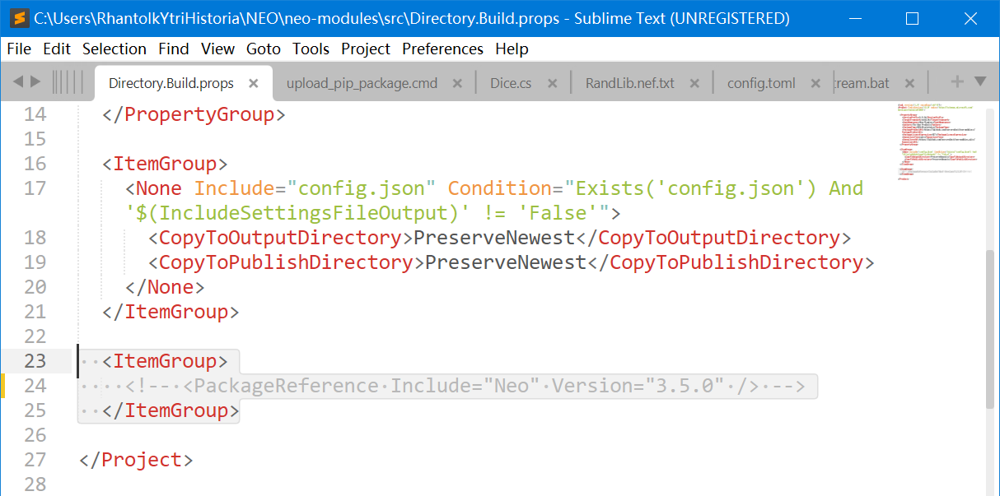

Prerequisites: English, Windows cmd or Linux bash, understanding of Windows PATH (or the counterpart on Linux), Git (clone, pull, checkout, branch), 50GB SSD, 8 GB memory.

In many situations, you may really enjoy debugging your neo3 smart contract using [neo-express](https://github.com/neo-project/neo-express). However, you may have met some frustrating exceptions raised deep from the source code of neo that you have no idea how to fix them. Besides, you may desire to inspect a running [neo-node](https://github.com/neo-project/neo-node/) instead of its static source codes. 

Follow this guide to set a full Neo.CLI (3.5.0) on Windows 10 that can be debugged! We will attempt to install the C# environment for neo, and interact with the blockchain using Python. 

Some screenshots in this guide might be in Chinese. 

#### Install Visual Studio 2022 (Community)

Because Visual Studio 2019 does not natively support .NET 6.0 to .NET 8.0, we had better use the latest version. 

Neo 3.5.* is built with .NET 6.0, and Neo 3.6.* with .NET 7.0, Neo 3.7.* with .NET 8.0.

Choose .NET desktop development and C++ desktop development, and wipe of some unnecessary components. Here we do not consider Python, but you may also install Python workloads in Visual Studio. The following workloads should be enough (C++ environments are for Python). You can also install Windows 10 SDK (after you finish this tutorial), so that you can compile C(++)-related dependencies in the future. 


Let Visual Studio Installer download for you. We can just move on. 

#### Install Python >=3.8 (and maybe an IDE for Python)

3.9+ is also OK, but not 3.7! I suggest downloading it from https://www.python.org/downloads/ .

Ensure that Python executables are added to your PATH, and that the command `pip` can be used. Try this in your local terminal: 

```bash
pip install requests
```

#### Download codes of Neo.CLI and other projects

```bash
git clone git@github.com:neo-project/neo.git
```

And you may still need to download the [release](https://github.com/neo-project/neo-node/releases) of `Neo.CLI`. This is just for two `leveldb` dll files inside the released zip file: `Plugins/LevelDBStore.dll` and `libleveldb.dll`. The dlls will be copied into the compiled neo-node later. 

Then you should also 

```bash
git clone git@github.com:neo-project/neo-modules.git
```

**Put your neo codes into neo-modules.** You should have a path that looks like:

```
neo-modules/neo/src/Neo.CLI
```

Do not forget to consider `git checkout` a proper commit or branch for each repository, so that the versions of all these codes can match. 

#### [Download the **N3 testnet** offline package](https://sync.ngd.network/)

Make sure you are actually downloading N3 testnet 5 (N3T5) full offline package. Unzip it and get the file `chain.0.acc`.

#### Wait for Visual Studio Installation...

The following steps may fail if Visual Studio is not installed.

#### Open `neo-node.sln` with Visual Studio and add projects to it

**This is an outdated chapter for the time when Neo had separate repositories for each project. I keep the contents because they may still be helpful.**

Add projects `neo`, `neo-vm` and `RpcServer` (in `neo-modules`) to the solution. Add project `neo` as project reference for neo-cli. If there is any compilation error, especially package dependency conflict, consider adding neo-vm as project reference for neo-cli. The package dependencies of neo-cli should be cleared. Optionally and optimally, let `neo-cli` refer to project `RpcServer`, and `RpcServer` refer to project `neo`. 


Newcomers to Visual Studio or C# may wonder how to remove the package reference of `RpcServer` to `neo`, and let `RpcServer` refer to `Neo.csproj`. Actually you need to edit `neo-modules/src/Directory.Build.props`, commenting out the package reference:



You may also want to write a source code project reference in `Directory.Build.props`:

```xml
  <ItemGroup>
    <!-- <PackageReference Include="Neo" Version="3.6.0" /> -->
    <ProjectReference Include="..\..\..\neo\src\neo\neo.csproj" />
  </ItemGroup>
```

Let's view the project references of me. `neo-vm` does not need any dependency package or project reference. 


#### Run Neo.CLI on testnet at debug mode

Paste the content of `Neo.CLI/config.testnet.json` into `Neo.CLI/config.json`, replacing the original `Neo.CLI/config.json`. This ensures that Neo.CLI connects to the testnet instead of the mainnet. 

Set Neo.CLI as the Startup project and debug it. It is likely that the cli would not run properly and throw some exceptions about leveldb. Just copy `libleveldb.dll` to `Neo.CLI\bin\Debug\net8.0`, and `LevelDBStore.dll` to `Neo.CLI/bin/Debug/net8.0/Plugins/LevelDBStore`. 

If Neo.CLI is started properly, execute `show state` and watch if it is synchronizing blocks. 

#### Sync blocks at insane speed!

Stop Neo.CLI. Put `chain.0.acc` at `Neo.CLI\bin\Debug\net8.0`. Add `--noverify 1` flag in Neo.CLI debug properties. 


Launch Neo.CLI. 

#### Install RpcServer plugin

Plugins should be put in `Neo.CLI/bin/Debug/net8.0/Plugins`. Assuming that you are going to install `SomePlugin`, you need to create a directory `SomePlugin` in `Plugins`, and put `SomePlugin.dll`  and its `config.json` into `Plugins/SomePlugin/`.

If you did not let `Neo.CLI` refer to `RpcServer`, a simple way here is just to execute `install RpcServer` in `Neo.CLI` (But remember that the installed `RpcServer` cannot be debugged!)

For a debuggable `RpcServer`, you can replace the installed `Neo.CLI/bin/Debug/net8.0/Plugins/RpcServer/RpcServer.dll` with that compiled in debugging mode from the project RpcServer in `neo-modules`. Specifically, add project reference `neo` to `RpcServer`, and build `RpcServer` in debug mode. Move `RpcServer.dll` and maybe directory `RpcServer` from `neo-modules/src/RpcServer/bin/Debug/net8.0/` to `Neo.CLI/bin/Debug/net8.0/Plugins/RpcServer`. Add project reference `RpcServer` for `Neo.CLI`.  

Now edit `Neo.CLI/bin/Debug/net8.0/Plugins/RpcServer/config.json` to make sure that your configs matches the testnet. For example, the `network` value should be the same as that in `Neo.CLI/config.testnet.json`, and meanwhile you probably want to leave `"DisabledMethods": []`. You may also consider larger values for `MaxGasInvoke`, `MaxConcurrentConnections` and `MaxIteratorResultItems`. Watch my config as an example for testnet T5 (with Neo.CLI 3.5.0):

```json
{
  "PluginConfiguration": {
    "Servers": [
      {
        "Network": 894710606,
        "BindAddress": "0.0.0.0",
        "Port": 16868,
        "SslCert": "",
        "SslCertPassword": "",
        "TrustedAuthorities": [],
        "RpcUser": "",
        "RpcPass": "",
        "MaxGasInvoke": 200,
        "MaxFee": 0.1,
        "MaxConcurrentConnections": 40,
        "MaxIteratorResultItems": 100,
        "DisabledMethods": [],
        "SessionEnabled": true,
        "SessionExpirationTime": 86400
      }
    ]
  }
}
```

Restart Neo.CLI to ensure that RpcServer is actually started. 

#### Wait for Neo.CLI block synchronization

Execute `show state` in Neo.CLI, and wait for your local blocks to be synced to the latest height. **The info about your peers' IP/port/listen/height is NOT displayed when the offline package `chain.0.acc` is being used.** Do not panic if you run into a few exceptions (e.g. `Method XXX with X parameters doesn't exist in the contract ...`, `Object reference not set to an instance of an object.`). These exceptions are caused by invalid transactions relayed by users. 


#### Test breakpoints

Congratulations. You are now probably able to inspect the execution of all the assembly instructions in your compiled smart contract. Try adding a breakpoint at `ExecuteInstruction();` in `neo-vm/ExecutionEngine.cs`, near the following codes

```csharp
                    try
                    {
                        ExecuteInstruction();
                    }
                    catch (CatchableException ex) when (Limits.CatchEngineExceptions)
                    {
                        ExecuteThrow(ex.Message);
                    }
```

#### [Data conversion tool for Neo](https://neo.org/converter/index)

#### Test RPC calls

Make sure your Neo.CLI has been equipped with the plugin `RpcServer`, and that the config (especially `Network`, `MaxGasInvoke`, `MaxFee`, `MaxIteratorResultItems`) is proper. You probably would like to leave `"DisabledMethods": []` to `openwallet` from another process. 

Certainly you can use tools like [Hoppscotch](https://github.com/hoppscotch/hoppscotch) as an HTTP client, but you may also use the client module [neo-fairy-client](https://github.com/Hecate2/neo-fairy-client/) with `git clone git@github.com:Hecate2/neo-fairy-client.git` as a non-official Python RPC client. This package rules out the difficulty from data conversion, and allows you to interact with Neo.CLI in very natural, detail-irrelevant codes. There are also official RPC clients built in a series of common programming languages, included in official Neo SDKs. Consider [neo-test](https://github.com/ngdenterprise/neo-test) or `NeoRpcClient` in [neo-mamba](https://github.com/CityOfZion/neo-mamba).

Make sure your `invokefunction` calls can break at breakpoints in `neo-vm`. If your RPC calls are well debuggable, consider upgrading your `RpcServer` with [neo-fairy-test](https://github.com/Hecate2/neo-fairy-test/).

#### Compile your contract with .nefdbgnfo!

If your contract is written in Python, the compiler `neo3-boa` should automatically give you an `.nefdbgnfo` file along with the `.nef` binary contract. This file is important, mapping the compiled byte-code neo-vm instructions back to the high-level Python source codes. 

If the contract is in C#, the compiler [nccs](https://www.nuget.org/packages/Neo.Compiler.CSharp/) may not give the `.nefdbgnfo` file. You can compile your contract in this way:

```bash
nccs YourContractCsprojFile.csproj --debug
```

where `nccs` can be installed globally with `dotnet tool install --global Neo.Compiler.CSharp --version 3.5.0`.

`dotnet restore` and `dotnet build` may be needed for successful compilation (alternatively, click the build and run button of your contract's csproj in your Visual Studio). You can also run your compiler with source codes by `git clone git@github.com:neo-project/neo-devpack-dotnet.git` and by running the project `Neo.Compiler.CSharp` inside, with argument of your contract `.csproj` file and `--debug` flag.

For very complex contracts, you can `git clone git@github.com:neo-project/neo-devpack-dotnet.git`, edit the compiler codes and run/debug `src/Neo.Compiler.CSharp/Neo.Compiler.CSharp.csproj` (which is just `nccs`).

#### DumpNef

For Neo >= 3.6.0:

https://github.com/Hecate2/DumpNef/ (Inherited from [devhawk](https://github.com/devhawk/DumpNef/). Not surely works for now!)

For Neo <= 3.5.*:

https://www.nuget.org/packages/DevHawk.DumpNef/

This is a tool to inspect the disassembly of your `.nef` smart contract. Certainly you can debug with [neo-debugger](https://github.com/neo-project/neo-debugger), but at assembly level with source codes of `neo` and `neo-vm`, you can inspect all the confusing exceptions. For a neo 3.5.0 compatible version, install `DumpNef` with

```bash
dotnet tool install --global DevHawk.DumpNef --version 3.5.7
```

Then, assuring that `.nefdbgnfo` is along with your `.nef` contract file,

```bash
dumpnef YourNefFile.nef
dumpnef YourNefFile.nef > YourNefFile.nef.txt
```

#### Using [Fairy](https://github.com/Hecate2/neo-fairy-test/)

This is something similar to but more powerful than [hardhat](https://github.com/NomicFoundation/hardhat) and [truffle](https://github.com/trufflesuite/truffle). Try placing a Fairy [release](https://github.com/Hecate2/neo-fairy-test/releases) as a plugin of Neo.CLI (which may not work correctly on different computers...) or building Fairy by yourself along with the source codes required by [Fairy.csproj](https://github.com/Hecate2/neo-fairy-test/blob/master/Fairy.csproj) (which requires a deeper understanding of C# building process). If you have trouble building or resolving project dependencies of Fairy, you may refer to the dependencies of [neo-modules](https://github.com/neo-project/neo-modules). 

**You are now able to debug all Neo smart contracts.** 

### Source Code Navigation

The first thing is: **Do not think it very difficult!**

Carl Von Clausewitz: **Everything in war is very simple, but the simplest thing is difficult.**

#### Data flow paradigms: `Tell ` and `OnRecieve` in Akka.NET

Neo is event-driven using Akka.NET. Many key components run as Akka actors that can receive message  from other actors. Typically a message is sent by the source actor using `destination_actor.Tell(message)`, and then the message is handled by the `OnReceive` method of the destination actor. By overriding the `OnReceive` method provided Akka.NET in your destination actor class, your actor can switch among different data types to handle the incoming messages. 

Let's visit some key components in the source code of Neo, so that you can navigate yourself through the data flow of different types of payloads.

#### RemoteNode

`neo/Network/P2P/RemoteNode.cs`

`neo/Network/P2P/RemoteNode.ProtocolHandler.cs`

The network of Neo and many other blockchains are peer-to-peer. Each node have multiple peers, each managed by a different `RemoteNode` object. 

Well, indeed you need to start the visit from `neo/Network/P2P/Connection.cs`, because the `OnReceive` method originates from there. But for now let's ignore the unnecessary TCP connection details, and head to the `OnMessage` method in `neo/Network/P2P/RemoteNode.ProtocolHandler.cs`.

WOW! Exactly a fascinating method as was expected, isn't it? Luckily, still we do not need to know too much about all kinds of messages for now. We can head to **`OnInvMessageReceived`** in the same file, which focuses on only **`Inventory`**, which includes **`Block`, `Transaction` (often abbreviated as `tx`), and `ExtensiblePayload`**.

And, there is nothing to fear! `OnInventoryReceived` is quite a simple method. All the new, unknown transactions go to `TransactionRouter` through `system.TxRouter.Tell(new TransactionRouter.Preverify(transaction, true))`. And new blocks and `ExtensiblePayload`s goes to the `OnReceive` method in the `Blockchain` class at `neo/Ledger/Blockchain.cs`. 

**Feel free to skip a few following sections** if you are really familiar with blockchains and the three types of inventories. 

#### Transaction

~~A transaction is a set of related tasks treated as a single action~~, just like what had been defined in database transactions... Oh right, just forget the formal definitions if you are not even a computer science professional. 

If you had purchased a bunch of goods in supermarkets, you must have the experience of paying the cashier to claim the ownership of your goods. Sometimes you even enjoy discount vouchers (let's say -10\$) if the total price exceeds a certain value (say 100\$). A transaction is just the procedure happening at the checkout counter. What you (and the cashier) will do is to sum up the prices of each kind of good, verifying that the total price (say 105\$) does exceeds 100\$, and to pay an 100\$ note along with the -10\$ voucher to receive the change of a 5\$ note. 

The key of a transaction is that it should either fully succeed (you pay the 100\$ AND the voucher, AND get ALL the goods, AND receive the 5\$ change), or fully fail (when the checkout counter is heavily queued and you want to quit without buying anything, or when the computers at the counter crash!). This is the **ATOMICITY** property of a transaction.

Then your transaction should move the money, vouchers and goods in **CONSISTENCY**. There should be no two copies of 100\$ notes, and also the 100\$ should not vanish. Sounds funny? This is because the simplest thing is difficult. Many smart contracts (do not care about what it is for now) become dangerously vulnerable for the inconsistent intermediate codes exploited by hackers. Such vulnerabilities can lead to billions of losses. For another example, the supermarket should not oversell too many goods in its computer system, when 100 customers are competing for only 10 inventories. The problem of overselling had also made troubles in online shopping.

Also the operations DURING the transaction is not visible by other transactions. You cannot pause the checkout process, get another bunch of goods, checkout at another counter with your voucher, and go back paying only 100\$ requesting for a 5\$ change. This property is called **ISOLATION**. 

After your checkout, the anti-theft system of the supermarket should view your goods as YOURS, without exploding with an alarm. This is because your transaction has taken its effect after its success. This property is called **DURABILITY**.

The 4 properties of a transaction stated above are abbreviated as **ACID**. **What you need to know is** that a transaction either completely fails, or completely succeeds, without leaving the state of intermediate steps visible to other transactions. 

#### Block

Well... Maybe you are even wondering what a blockchain is?

The ultimate goal of a blockchain is to keep processing **ALL KINDS OF** transactions, ranging from purchasing goods to computing with the Elliptic Curve Digital Signature Algorithm (**ECDSA**) to prove that you are the private key (`KwVrz2kveuTuQWPyTKdB379H91gScxP2vpakfAcsU31izFfcHKdJ`) owner of the public key `0262cafcd9cba9463c868e6f9e3cbe490d658941cee3523d4011090a344287e2e1`, and that you are qualified for getting the air-dropped apples provided by someone else's merkle tree root in the smart contract, and to finally obtain the apples. 

Then how to process the transactions? In a blockchain network, there are **consensus nodes** who are responsible to **compute the new state** after users' transactions are processed. When transactions have indeed been processed by consensus nodes, a new block is published to let everyone in the network to replay all the transactions in their own node, based on the finishing state of the previous block. 

Why do we have to employ consensus nodes, instead of everyone just playing on its own? Pay attention that some transactions make conflicts (we can never serve 100 customers with 10 apples), and that some transactions may be unexpectedly dropped when they are propagated through the whole network. Therefore it is needed to **order the transactions and select only valid ones**. It is the job of consensus nodes to pick the valid transactions, and publish the final decision for the whole network, **in order to form a network-wide single version finality of fact**. 

The consensus nodes (not necessary to be a fixed group of people) then keeps publishing new blocks, which contains new transactions ordered by users, to maintain the service of the latest single finality of fact. In Neo, a new block should be published in every 15 seconds. 

When a new node joins the network, it should download ALL the previous blocks from other nodes, in order to compute the current version of finality. 

#### Private Key, Public Key, and Digital Signature

The important algorithm **ECDSA** is mentioned in the previous section to make digital signatures. In a blockchain network, you are identified by your private key (just pick a very long random "password", and keep it as your secret). You can generate your public key (a very long "user name") using your private key (yes we are generating the account with a password) through elliptic curve operations. Then you can write your public key in your transaction, and sign your transaction using your private key to **prove** that you are the one who generated the public key with the private key. This is how we identify different users on the blockchain.

#### Wallet, Account, Verification, ScriptHash, Wallet Address, Multisig, ...

- Wallet is simply a container. A wallet can include multiple accounts.
- You sign on transactions with your private key to prove that it was you who want to run the transaction.
- Others verify the validity of a transaction by executing its **verification script**. Usually the script looks like:

```
# Push your public key
PUSHDATA1 02878528d4e2e39cedf20d9dbc9e5a031afc60cb9c474348ec893834c7921fb0b9
SYSCALL System.Crypto.CheckSig
```

This script was created when your account was initialized, and then copied into every transaction you send. 

- "Who am I?": Smart contracts deployed on-chain tell who you are through the scripthash of your account, which is simply `RipeMD160(SHA256( yourVerificationScript ))`. In an extreme case, you can create an account with verification script `PUSH1` to let it always return `True`. Then you can find its scripthash, and send GAS to it, making it a charity account for anyone to use!
  - On-chain smart contracts themselves know nothing about the content of verifiaction scripts. They only know the scripthash of them.
- You can also PUSH multiple public keys in the verification script, and check all the signatures, and then require that at least (or at most, though not a typical case) some (from zero to all) of the public keys have signed the transaction. This is how multisig accounts work.

In practice, there is also `wallet address`, which is an equivalent of scripthash. Wallet addresses (starting with `N` in Neo) is simply `base58checkEncode(addressVersion.Concat(ScriptHash))`, making it easier for humans to input the scripthash. When you make a mistake in the input address, `base58checkEncode` can probably identify it, and ask you to check the input. 

#### ExtensiblePayload

`ExtensiblePayload` is used for many types of applications, but most typically for the **dBFT** consensus algorithm (watch the source codes at https://github.com/neo-project/neo-modules/tree/master/src/DBFTPlugin). 

#### dBFT 2.0

This is almost PBFT (ignore if you do not know it), only that voting is introduced to elect consensus nodes. Some of you may have tried to know the details of the consensus algorithm. But here I am trying to explain it in simple words, dropping all the unnecessary details.

1. The consensus node at PRIMARY VIEW drafts a new block, and relay it in `PrepareRequest`
2. All the other consensus nodes, at BACKUP VIEW, **validates** that the new block in `PrepareRequest` is valid. 
3. Each BACKUP node relays a `PrepareResponse` to agree on the new block.
4. ANY consensus node can send a `Commit` message, **trying to prove** to other nodes that it has collected enough `PrepareResponse` messages (that agrees with the new block) from more than 2/3 of consensus nodes.
5. ANY consensus node can finally publish the new block when it receives more than 2/3 `Commit` messages.

All the types of messages mentioned above, are of `ExtensiblePayload` type.

#### TransactionRouter

In order to relieve the burden for consensus nodes, we (as ordinary nodes) filter all the invalid transactions in TransactionRouter, in `neo/Ledger/TransactionRouter.cs`. Be aware that a `new TransactionRouter.Preverify(transaction, true)` (instead of the transaction itself) is told to `TransactionRouter`. We need to handle the incoming message also as a `Preverify` object. Then a `PreverifyCompleted` object is further `Tell`ed to the `Blockchain`. 

#### Blockchain

Here I am talking about `neo/Ledger/Blockchain.cs`. See the method `OnReceive` and then `OnInventory` and `OnPreverifyCompleted`. 

In `OnPreverifyCompleted`, successful transactions are further processed by `OnInventory`.

In `OnInventory`, new blocks, transactions and extensible payloads are verified. New blocks are used to compute the latest version of fact, and stored in your hard drive. New transactions are placed in `MemoryPool` in case our peers need the contents of them. Extensible payloads, typically used for consensus, are also verified to ensure that they are actually **signed** by eligible ones. 

#### LocalNode

In `neo/Network/P2P/LocalNode.cs`, majorly responsible for managing my connection to all the other nodes. Here we are going to relay new blocks and transactions and extensible payloads (that are potentially not seen by our peers) in the method `OnRelayDirectly`. We will head to `RemoteNode` again in `neo/Network/P2P/RemoteNode.cs` to relay the new inventories to each peer.

Congratulations! You have just finished the simple routes of inventory data flows! 

```
block/tx/extensible payload
-> [tell inventory to Blockchain / Preverify to TransactionRouter]
-> blockchain
-> [tell RelayDirectly]
-> localnode
-> [foreach tell SendMessage]
-> remotenode
```

**You are now able to debug not only smart contracts, but also all the detailed data flow in `neo-node` itself.**

#### Decentralization? And more...

The value of blockchains is not only decentralization. **The core is the open network for everyone**. Based on that, **Do not trust or guarantee; Prove and Verify.**

For a traditional centralized web application, a consensus node can directly relay the new block when enough `PrepareResponse` messages are collected. This is because all the machines trust the others. However, in an open network for everyone, we cannot rule out the possibility of consensus nodes making mistakes or misbehaving. You need to also **prove** that enough agreement is reached, and let others **verify** your proof. This is the core spirit of decentralization. 

Some people pursue full decentralization, but unfortunately the dream still lies as a fairy tale. The theoretically ultimately decentralized networks, such as Bitcoin and Ethereum, are actually controlled by a few top consensus members, for owning tremendous computation power or ETH stakes. 

However we do have made significant progresses. Traditionally, you and your counterparty have to simultaneously trust some Web2 giants in order to proceed with transactions, stressing a heavy burden for those giants. Giants are powerful, while only offer simple transactions like buying apples. But nowadays, humans have managed to build whole colorful industry chains, without the intermediate giant bondsmen, running from iron ores and coal to vehicles and warships, backboned by blockchains. (**Visit the blockchain service network, or BSN in China!**) No giant can hold the burden heavy as that: guarantees for thousands of companies and millions of different technologies. 

Blockchains are not either full decentralization or nonsense. Full decentralization is neither applicable nor necessary. The open protocol with appropriate extent of decentralization, for efficient cooperation and reasonable supervision, is demonstrating a new world, saving our efforts to trust and guarantee. 