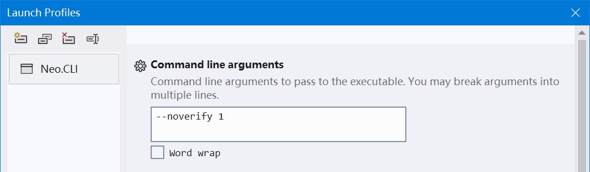

In many situations, you may really enjoy debugging your neo3 smart contract using [neo-express](https://github.com/neo-project/neo-express). However, you may have met some frustrating exceptions raised deep from the source code of neo that you have no idea how to fix them. Besides, you may desire to inspect a running [neo-node](https://github.com/neo-project/neo-node/) instead of its static source codes. 

Follow this guide to set a full neo-cli (3.1.0) on Windows 10 that can be debugged! We will attempt to install the C# environment for neo, and interact with the blockchain using Python. 

Some screenshots in this guide might be in Chinese. 

#### Install Visual Studio 2022 (Community)

Because Visual Studio 2019 does not natively support .NET 6.0, we had better use the latest version. 

Choose .NET desktop development and C++ desktop development, and wipe of some unnecessary components. Here we do not consider Python, but you may also install Python workloads in Visual Studio. The following workloads should be enough (C++ environments are for Python). Be aware that **Windows 10 SDK is needed so that you can compile components of [neo-mamba](https://github.com/CityOfZion/neo-mamba).**


Let Visual Studio Installer download for you. We can just move on. 

#### Install Python 3.8 (and maybe an IDE for Python)

3.9 is also OK, but not 3.7! I suggest downloading it from https://www.python.org/downloads/ .

Ensure that Python executables are added to your PATH, and that the command `pip` can be used. Try this in your local terminal: 

```bash
pip install requests
pip install neo3-boa
```

#### Download codes of neo-cli and other projects

```bash
git clone git@github.com:neo-project/neo-node.git
```

And you may still need to download the [release](https://github.com/neo-project/neo-node/releases) of `neo-cli`. This is just for two `leveldb` dll files inside the released zip file: `Plugins/LevelDBStore.dll` and `libleveldb.dll`. The dlls will be copied into the compiled neo-node later. 

Then you should also 

```bash
git clone git@github.com:neo-project/neo.git
git clone git@github.com:neo-project/neo-vm.git
git clone git@github.com:neo-project/neo-modules.git
git clone git@github.com:CityOfZion/neo-mamba.git
```

Do not forget to consider `git checkout` a proper commit or branch for each repository, so that the versions of all these codes can match. 

#### [Download the **N3 testnet** offline package](https://sync.ngd.network/)

Make sure you are actually downloading N3 testnet full offline package. Unzip it and get the file `chain.0.acc`.

#### Wait for Visual Studio Installation...

The following steps may fail if Visual Studio is not installed.

#### Open `neo-node.sln` with Visual Studio and add projects to it

Add projects neo, neo-vm and RpcServer (in neo-modules) to the solution. Add project neo as project reference for neo-cli. If there is any compilation error, especially package dependency conflict, consider adding neo-vm as project reference for neo-cli.

The package dependencies of neo-cli should be cleared.


#### Run neo-cli on testnet at debug mode

Paste the content of `neo-cli/config.testnet.json` into `neo-cli/config.json`, replacing the original `neo-cli/config.json`. This ensures that neo-cli connects to the testnet instead of the mainnet. 

Set neo-cli as the Startup project and debug it. It is likely that the cli would not run properly and throw some exceptions about leveldb. Just copy `libleveldb.dll` to `neo-cli\bin\Debug\net6.0`, and `LevelDBStore.dll` to `neo-cli\bin\Debug\net6.0\Plugins`. 

If neo-cli is started properly, execute `show state` and watch if it is synchronizing blocks. 

#### Sync blocks at insane speed!

Stop neo-cli. Put `chain.0.acc` at `neo-cli\bin\Debug\net6.0`. Add `--noverify` flag in neo-cli debug properties. 



Launch neo-cli. 

#### Install RpcServer plugin

A simple way is just to execute `install RpcServer` in `neo-cli`, and edit `neo-cli/bin/Debug/net6.0/Plugins/RpcServer/config.json` to make sure that your configs matches the testnet. For example, the `network` value should be the same as that in `neo-cli/config.testnet.json`, and meanwhile you probably want to leave `"DisabledMethods": []`. You may also consider larger values for `MaxGasInvoke`, `MaxConcurrentConnections` and `MaxIteratorResultItems`. But remember that the installed dlls cannot be debugged! You can replace the installed `neo-cli/bin/Debug/net6.0/Plugins/RpcServer.dll` with that compiled in debugging mode from the project RpcServer in `neo-modules`. Specifically, add project reference `neo` to `RpcServer`, and build `RpcServer` in debug mode. Move `RpcServer.dll` and maybe directory `RpcServer` from `neo-modules/src/RpcServer/bin/Debug/net6.0/` to `neo-cli/bin/Debug/net6.0/Plugins`. Add project reference `RpcServer` for `neo-cli`.  

Execute `start RpcServer` after RpcServer is equipped with debuggable dlls and correct configs, or just restart neo-cli. 

#### Install neo-mamba

```bash
cd neo-mamba
python setup.py install
```

If `python setup.py install` is deprecated, try `python setup.py build` and then `pip install the-whl-file-that-was-built.whl`

This step involves C language compilation. I cannot really help if there is any error, but if you do meet exceptions, try upgrading your pip and `pip install cmake`.

#### Wait for neo-cli block synchronization

Execute `show state` in neo-cli, and wait for your local blocks to be synced to the latest height. 


#### Test breakpoints

Congratulations. You are now probably able to inspect the execution of all the assembly instructions in your compiled smart contract. Try adding a breakpoint at `ExecuteInstruction();` in `neo-vm/ExecutionEngine.cs`, near the following codes

```csharp
                    try
                    {
                        ExecuteInstruction();
                    }
                    catch (CatchableException ex) when (Limits.CatchEngineExceptions)
                    {
                        ExecuteThrow(ex.Message);
                    }
```

#### [Data conversion tool for Neo](https://neo.org/converter/index)

#### Test RPC calls

Make sure your neo-cli has been equipped with the plugin `RpcServer`, and that the config (especially `Network`, `MaxGasInvoke`, `MaxFee`, `MaxIteratorResultItems`) is proper. You probably would like to leave `"DisabledMethods": []` to `openwallet` from another process. 

Certainly you can use tools like [Hoppscotch](https://github.com/hoppscotch/hoppscotch) as an HTTP client, but you may also use the client module [here](https://github.com/Hecate2/neo-ruler) with `git clone git@github.com:Hecate2/neo-ruler.git` and check out the directories `neo_test_with_rpc` and `tests` as a non-official Python RPC client. This package rules out the difficulty from data conversion, and allows you to interact with neo-cli in very natural, detail-irrelevant codes. There are also official RPC clients built in a series of common programming languages, included in official Neo SDKs. 

Make sure your `invokefunction` calls can break at breakpoints in `neo-vm`. 

To be continued...

